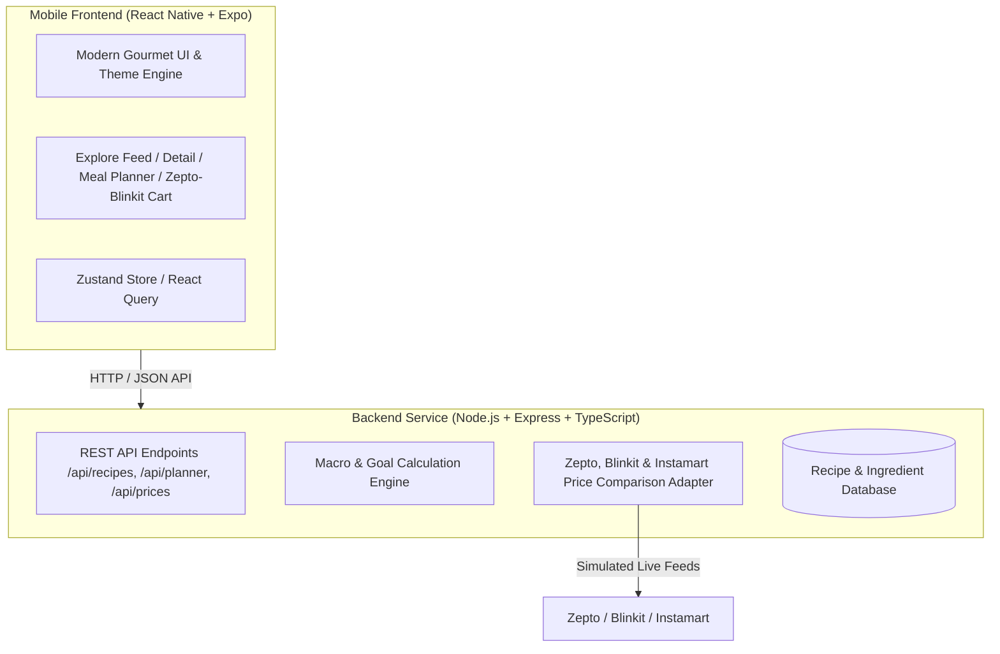

# 🥑 BiteCraft (Student & Beginner Smart Recipe App)
### Cross-Platform iOS & Android Mobile App with Full-Featured Backend

---

## 🎯 Executive Overview & Product Concept
Living alone in a new city as a student or young professional comes with unique friction points:
1. **Limited Cooking Skills & Minimal Kitchen Tools**: Beginners often only have an electric kettle, a single induction plate, or a basic pan.
2. **Strict or Dynamic Budgets**: Some days call for frugal survival meals (under ₹40–₹60), while other days people want luxury brunch ("Hi-Fi" Dragon Fruit Açaí Bowls, Truffle Pastas, Artisanal Avocado Toasts).
3. **Fitness & Nutrition Dilemma**: Beginners struggle to count protein, carbs, and calories to support fitness goals (weight gain / bulk vs. fat loss / deficit).
4. **Grocery Friction**: Ingredients are bought via Quick Commerce apps (**Zepto, Blinkit, Swiggy Instamart**). Knowing whether an entire recipe costs ₹80 or ₹400 across stores before cooking is a game changer.

---

## 🏗️ System Architecture

---

## 📱 Core Features & Screens

### 1. 🔍 Smart Recipe Discovery & Multi-Cuisine Feed
- **Budget Tier Selector**:
  - 🟢 **Broke Student** (< ₹60 per serving): Masala Oats with Boiled Eggs, 10-Min Poha, One-Pot Dal Khichdi, Egg Bhurji Wraps.
  - 🟡 **Balanced Everyday** (₹60 – ₹150 per serving): Paneer Tikka Quinoa Bowl, Chicken Teriyaki Rice, Creamy Tomato Pasta, Tofu Stir Fry.
  - 🟣 **Hi-Fi Gourmet** (₹150 – ₹450+ per serving): Dragon Fruit & Blueberry Açaí Bowl, Sourdough Avocado Poached Eggs, Truffle Mushroom Fettuccine, Salmon Protein Bowl.
- **Goal-Oriented Filters**:
  - 📈 **Weight Gain / Muscle Bulk**: High calorie density, 35g+ protein, clean carbs & fats.
  - 📉 **Weight Loss / Fat Loss**: High satiety, high protein volume eating, low calorie density.
  - ⚡ **Gym Bro High Protein**: Maximum protein-to-calorie ratio.
  - ⏱️ **Exam-Week Quickie**: Under 15 minutes, minimal dishes to wash.
- **Cuisine Filters**: Indian (North/South), Italian, Pan-Asian, Mexican, Continental, Middle Eastern.

### 2. 🍲 Beginner-Proof Recipe Detail Screen
- **Visual Macros Header**: Calorie count, Protein (g), Carbs (g), Fats (g), Fiber (g) with interactive percentage bars.
- **Kitchen Equipment Tag**: e.g. "Only 1 Pan Needed", "No Blender Required", "Microwave/Kettle Friendly".
- **Portion Cost vs Full Pack Cost**: Understand how much you spend for 1 meal vs total grocery pack purchase.
- **Interactive Step-by-Step Guide**: Checkable steps with built-in cooking timers and beginner pro-tips/substitutions.

### 3. 🛒 Live Quick-Commerce Price Comparator (Zepto, Blinkit, Instamart)
- Real-time side-by-side pricing for recipe ingredients across:
  - ⚡ **Zepto** (Instant 10 min)
  - ⚡ **Blinkit** (Instant 10-15 min)
  - ⚡ **Swiggy Instamart** (Instant 15 min)
- Highlights the cheapest store and shows potential savings.
- "Export to Quick-Commerce Cart" action.

### 4. 📅 "Vibe Planner" (Automated Daily Meal Plan)
- Input: Daily Budget (e.g. ₹150 vs ₹800) + Fitness Goal (Gain vs Loss).
- Output: Complete schedule for **Breakfast ➔ Brunch ➔ Lunch ➔ Evening Snack ➔ Dinner** with total macros and cost summarized.

---

## 🛠️ Technology Stack
- **Frontend**: React Native with **Expo SDK**, Expo Router, React Native Reanimated / Animated, Lucide Icons, and Web preview compatibility.
- **Backend**: Node.js, Express, TypeScript, CORS, SQLite / In-Memory JSON persistence.
- **API Services**:
  - `GET /api/recipes`: Filter by budget, cuisine, goal, meal type, prep time.
  - `GET /api/recipes/:id`: Full recipe details, cooking instructions, beginner hacks.
  - `GET /api/prices/compare`: Live ingredient pricing across Zepto, Blinkit, Instamart.
  - `POST /api/planner/generate`: Smart meal plan generator by budget and fitness goal.
